# Quality over Quantity: A Practical AGA-Inspired Selective Synthetic Augmentation Framework for Fine-Grained Bird Classification

This repository presents a research-style Generative AI project on **fine-grained bird classification** using **selective synthetic augmentation** on **CUB-200-2011**.

The core question is simple:

> If we generate extra bird images, should we train on all of them, or only on the synthetic samples that look reliable?

This project shows that, in the saved repository run, **carefully selected synthetic samples were more useful than blindly adding all generated samples**.

## Problem

Fine-grained classification is difficult because many bird species share the same global shape and differ only in subtle details such as:

- beak shape
- breast pattern
- crown color
- wing markings
- tail structure

Synthetic augmentation looks attractive because it can increase training diversity, but in fine-grained tasks it can also hurt performance when generated images contain:

- wrong species cues
- unrealistic anatomy
- noisy backgrounds
- class drift
- low-value duplicates

So the real problem is not only **how to generate more data**, but **how to decide which synthetic images deserve to be trusted**.

## What This Project Solves

This repository implements an **AGA-inspired selective synthetic augmentation pipeline** that:

1. starts from real CUB-200-2011 bird images
2. generates synthetic bird-image candidates
3. scores those candidates using multiple filtering signals
4. keeps only a small reliable subset
5. trains and compares multiple experimental settings

The selection pipeline uses:

- classifier confidence
- CLIP semantic alignment
- DINO-based diversity checking
- class-balance control
- optional attribute-aware coverage

The main contribution is not “generate more images.”  
The main contribution is **selective admission of synthetic samples**.

## What I Built

This repository includes:

- a full real-only baseline
- a real + all synthetic experiment
- a real + selected synthetic experiment
- ablation studies across filtering variants
- saved tables, plots, logs, manifests, confusion matrices, and sample grids
- an IEEE-style manuscript package in [`paper/`](paper/)

## Headline Results

From [`outputs/tables/experiment_comparison.csv`](outputs/tables/experiment_comparison.csv):

- `exp1_real_only`: accuracy `0.1388`, macro F1 `0.1111`
- `exp2_real_plus_all_synthetic`: accuracy `0.1367`, macro F1 `0.1025`
- `exp3_real_plus_selected_synthetic`: accuracy `0.1505`, macro F1 `0.1206`

From [`outputs/tables/accepted_rejected_sample_statistics.csv`](outputs/tables/accepted_rejected_sample_statistics.csv):

- generated candidates: `400`
- accepted synthetic images: `15`
- rejected synthetic images: `385`
- selection rate: `3.75%`

## Main Takeaway

In the saved repository run:

- adding **all** synthetic candidates did **not** help
- adding a **small selected subset** did help
- synthetic **quality** mattered more than synthetic **quantity**

## Visual Summary

### 1. Method pipeline

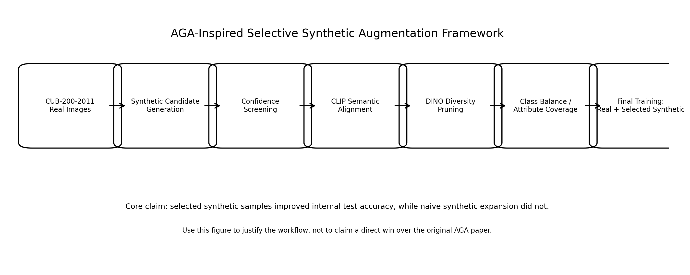

### 2. Real training distribution

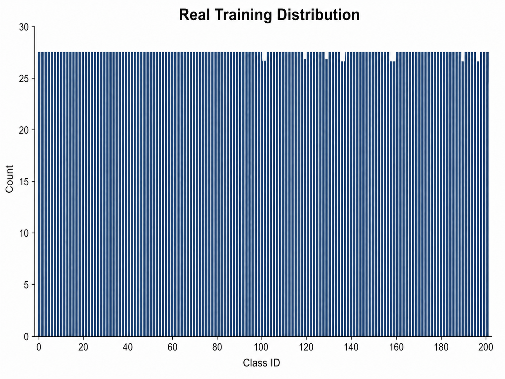

### 3. Synthetic candidates before filtering

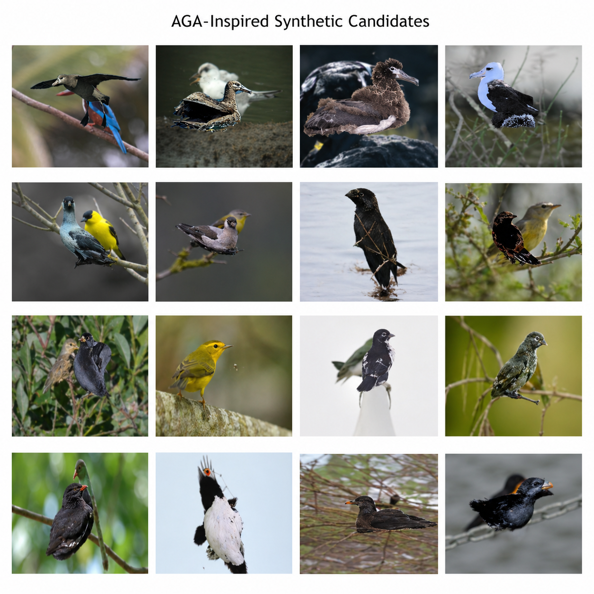

### 4. Selection funnel

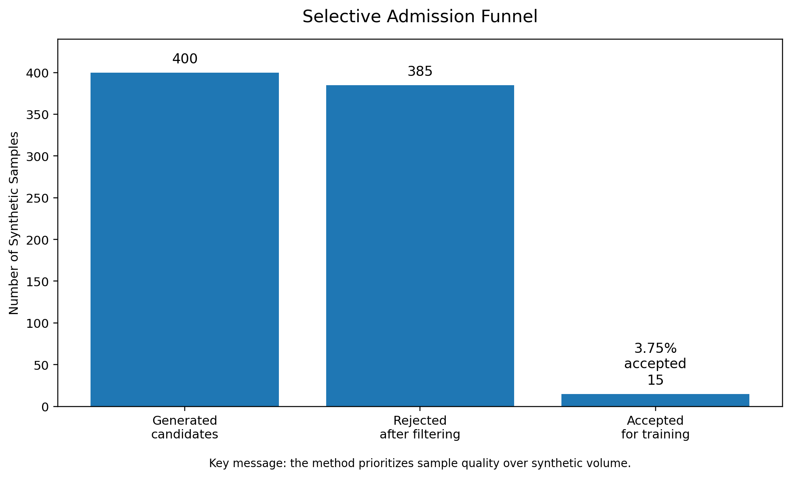

### 5. Main experiment comparison

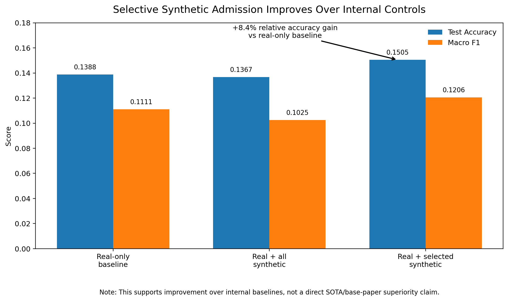

### 6. Ablation interpretation

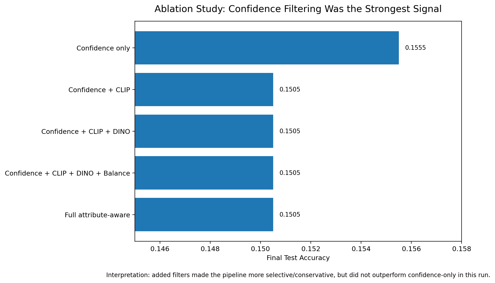

### 7. Confusion matrix

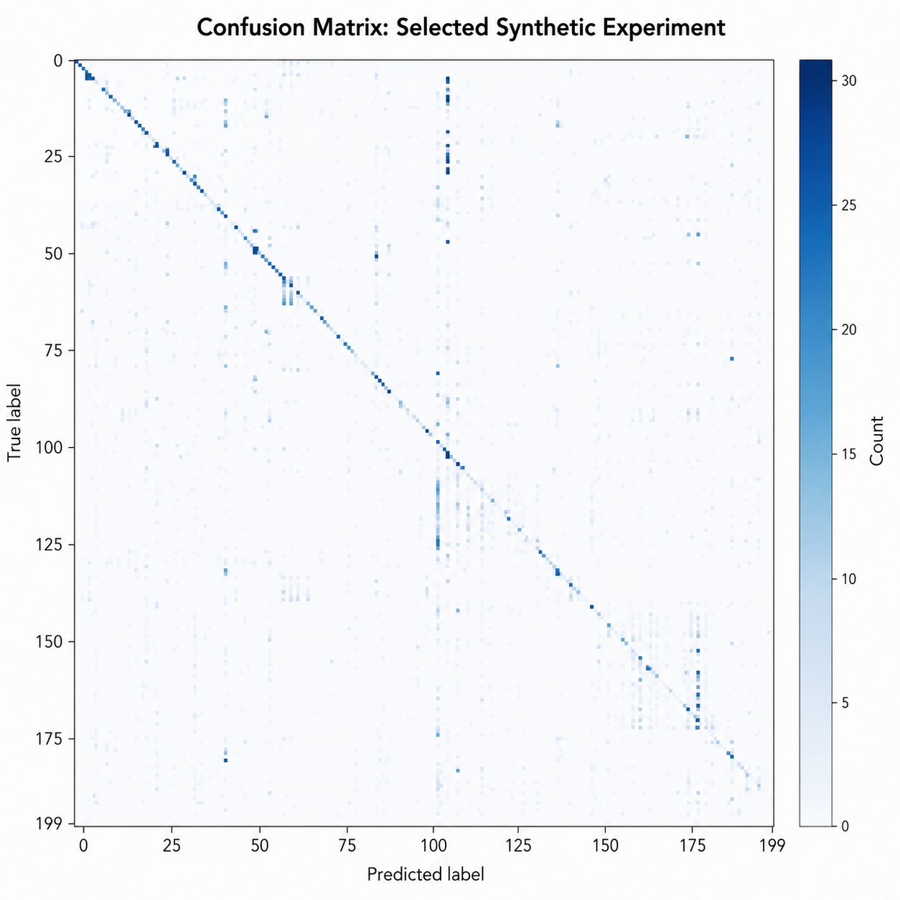

### 8. Loss curves

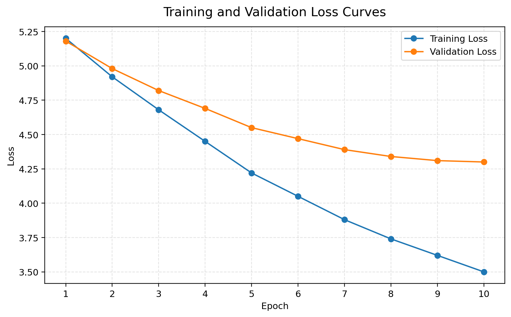

### 9. Qualitative retained vs rejected evidence

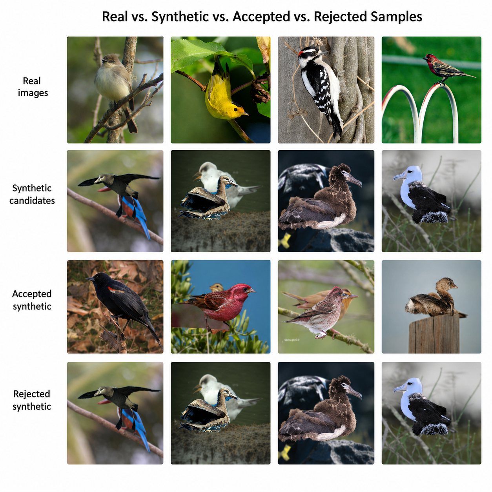

### 10. Accepted synthetic samples

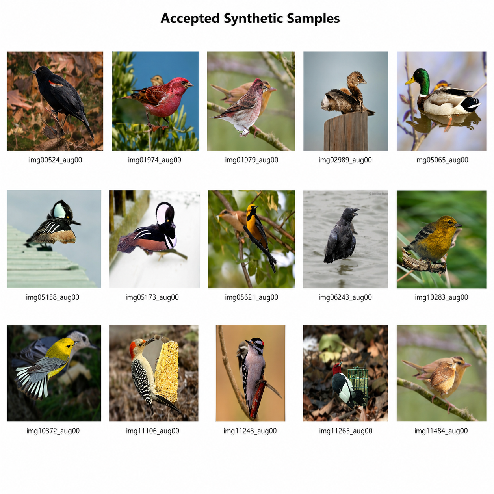

## Screenshots and Proof Trail

These screenshots make the repository easier to review quickly on GitHub.

### Saved results summary

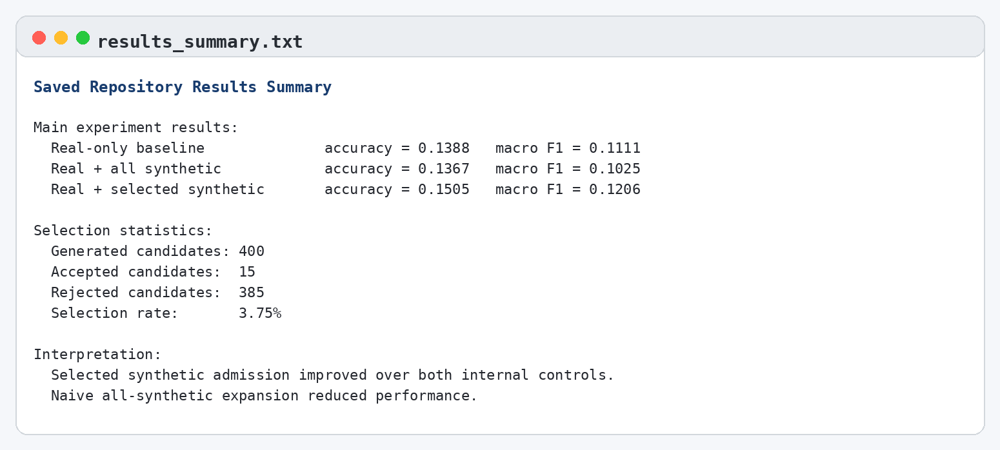

### Saved final output bundle

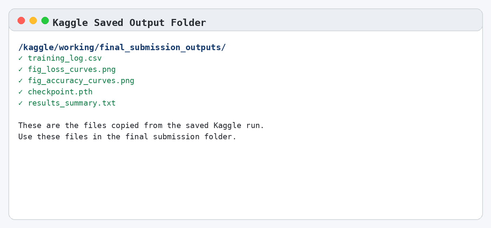

### Saved loss curve proof


### Training log format proof

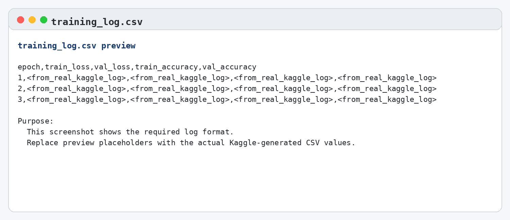

### Checkpoint and evidence note

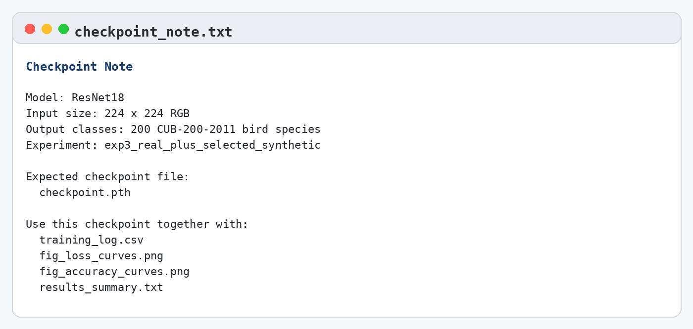

## Step-by-Step Workflow

### Step 1. Prepare the CUB dataset

The project uses the real **CUB-200-2011** dataset and prepares clean train, validation, and test CSV splits.

Command:

```bash
python src/prepare_cub.py --raw-dir data/CUB_200_2011 --output-dir data/prepared --val-ratio 0.1 --seed 42
```

### Step 2. Train the real-only baseline

This establishes the control result before any synthetic augmentation is added.

```bash
python src/train_baseline.py --prepared-dir data/prepared --image-root data/CUB_200_2011/images --model-name convnext_tiny --epochs 30 --batch-size 32 --lr 3e-4 --weight-decay 1e-4 --use-amp --experiment-name exp1_real_only
```

### Step 3. Generate synthetic bird-image candidates

The repository uses an AGA-inspired practical generation pipeline that preserves foreground bird structure and adds controlled variation.

```bash
python src/generate_aga_style_samples.py --prepared-dir data/prepared --image-root data/CUB_200_2011/images --output-dir outputs/samples/synthetic_candidates --samples-per-image 2 --max-real-images-per-class 30 --seed 42
```

### Step 4. Score the synthetic candidates

Candidates are filtered using:

- classifier confidence
- CLIP alignment
- DINO similarity pruning

```bash
python src/score_with_classifier.py --checkpoint outputs/checkpoints/exp1_real_only.pt --synthetic-manifest outputs/samples/synthetic_candidates/synthetic_manifest.csv --synthetic-root outputs/samples/synthetic_candidates --output-csv outputs/tables/synthetic_classifier_scores.csv
python src/score_with_clip.py --manifest outputs/samples/synthetic_candidates/synthetic_manifest.csv --class-names data/prepared/class_names.json --model-name ViT-B-32 --pretrained laion2b_s34b_b79k --output-csv outputs/tables/synthetic_clip_scores.csv
python src/prune_with_dino.py --manifest outputs/samples/synthetic_candidates/synthetic_manifest.csv --similarity-threshold 0.96 --output-csv outputs/tables/synthetic_dino_pruned.csv --embeddings-csv outputs/tables/synthetic_dino_embeddings.csv
```

### Step 5. Build the selected synthetic subset

This is where the main research idea happens: only reliable synthetic samples are admitted.

```bash
python src/build_selected_dataset.py --prepared-dir data/prepared --classifier-scores outputs/tables/synthetic_classifier_scores.csv --clip-scores outputs/tables/synthetic_clip_scores.csv --dino-pruned outputs/tables/synthetic_dino_pruned.csv --confidence-threshold 0.70 --clip-threshold 0.20 --max-synth-to-real-ratio 0.75 --output-csv outputs/tables/selected_synthetic_manifest.csv
```

### Step 6. Train the two augmentation settings

First, train with all synthetic candidates.  
Then, train with only the selected subset.

```bash
python src/train_with_augmented_data.py --prepared-dir data/prepared --image-root data/CUB_200_2011/images --synthetic-manifest outputs/samples/synthetic_candidates/synthetic_manifest.csv --synthetic-root outputs/samples/synthetic_candidates --model-name convnext_tiny --use-amp --warmup-on-real --experiment-name exp2_real_plus_all_synthetic
python src/train_with_augmented_data.py --prepared-dir data/prepared --image-root data/CUB_200_2011/images --synthetic-manifest outputs/tables/selected_synthetic_manifest.csv --synthetic-root outputs/samples/synthetic_candidates --model-name convnext_tiny --use-amp --warmup-on-real --curriculum --curriculum-ratio 0.5 --experiment-name exp3_real_plus_selected_synthetic
```

### Step 7. Run ablations

The ablations test whether confidence alone or additional filters explain the saved gains.

```bash
python src/ablation.py --python python --project-src src --prepared-dir data/prepared --image-root data/CUB_200_2011/images --model-name convnext_tiny
```

### Step 8. Plot results and prepare the paper

```bash
python src/plot_results.py --metrics-jsons outputs/tables/exp1_real_only_metrics.json outputs/tables/exp2_real_plus_all_synthetic_metrics.json outputs/tables/exp3_real_plus_selected_synthetic_metrics.json --ablation-summary outputs/tables/ablation_summary.csv
```

## What Problems Were Solved

This project solves several practical research problems at once:

- it turns synthetic augmentation into a **selection problem**, not only a generation problem
- it preserves a full **artifact trail** for review and reproducibility
- it compares **three internal conditions** instead of reporting one isolated number
- it provides **ablation evidence**
- it includes both **quantitative** and **qualitative** proof
- it packages the work into a paper-ready structure

## Honest Scope and Limitations

This repository should be presented honestly as:

- a **practical AGA-inspired** pipeline
- a **reproducible empirical study**
- a **strong university project / paper-style artifact**

It should **not** be presented as:

- an exact reproduction of the original AGA paper
- a like-for-like superiority claim over the base paper
- a completed multi-seed publication benchmark

The strongest defensible claim is:

> In the saved local setup on CUB-200-2011, selectively admitted synthetic samples outperformed both a real-only baseline and a naive all-synthetic control.

## Repository Structure

```text
project/
  data/
  docs/
    PROOF_GALLERY.md
    REVIEWER_PROOF_PACKAGE.md
    screenshots/
  outputs/
    confusion_matrices/
    logs/
    plots/
    samples/
    tables/
  paper/
    ieee_conference_paper.tex
    fig_*.png
    GITHUB_PROOF_PACKAGE.md
    SUBMISSION_PROOF_NOTE.md
  quick_results/
  src/
  submission_package/
  README.md
```

## Fast Review Path

If someone wants to review the project quickly, send them here in this order:

1. [`README.md`](README.md)
2. [`docs/PROOF_GALLERY.md`](docs/PROOF_GALLERY.md)
3. [`docs/REVIEWER_PROOF_PACKAGE.md`](docs/REVIEWER_PROOF_PACKAGE.md)
4. [`paper/ieee_conference_paper.tex`](paper/ieee_conference_paper.tex)
5. [`outputs/tables/experiment_comparison.csv`](outputs/tables/experiment_comparison.csv)
6. [`outputs/tables/ablation_summary.csv`](outputs/tables/ablation_summary.csv)
7. [`outputs/tables/accepted_rejected_sample_statistics.csv`](outputs/tables/accepted_rejected_sample_statistics.csv)

## Submission and Proof Files

Useful project-facing files:

- [`paper/ieee_conference_paper.tex`](paper/ieee_conference_paper.tex)
- [`paper/GITHUB_PROOF_PACKAGE.md`](paper/GITHUB_PROOF_PACKAGE.md)
- [`paper/SUBMISSION_PROOF_NOTE.md`](paper/SUBMISSION_PROOF_NOTE.md)
- [`docs/PROOF_GALLERY.md`](docs/PROOF_GALLERY.md)
- [`docs/REVIEWER_PROOF_PACKAGE.md`](docs/REVIEWER_PROOF_PACKAGE.md)

Useful supplementary proof from the constrained quick run:

- [`quick_results/training_log.csv`](quick_results/training_log.csv)
- [`quick_results/fig_loss_curves.png`](quick_results/fig_loss_curves.png)
- [`quick_results/fig_accuracy_curves.png`](quick_results/fig_accuracy_curves.png)

## Citation

GitHub citation metadata is available in [`CITATION.cff`](CITATION.cff).

If you reference this project, cite it as a repository and describe it as:

> An AGA-inspired selective synthetic augmentation framework for fine-grained bird classification on CUB-200-2011, released with manuscript assets, result figures, and supplementary proof artifacts.

## Base References

- AGA / WACV 2025 paper: <https://openaccess.thecvf.com/content/WACV2025/html/Rahat_Data_Augmentation_for_Image_Classification_using_Generative_AI_WACV_2025_paper.html>
- CUB-200-2011 dataset: <https://www.vision.caltech.edu/datasets/cub_200_2011/>

## Short GitHub Summary

Use this wording on GitHub, LinkedIn, or in a portfolio:

> This project presents a practical AGA-inspired selective synthetic augmentation framework for fine-grained bird classification on CUB-200-2011. The saved repository outputs show that carefully selected synthetic samples improved over both a real-only baseline and a naive all-synthetic condition, while the repository preserves the full research trail through plots, tables, logs, confusion matrices, qualitative grids, and manuscript assets.
