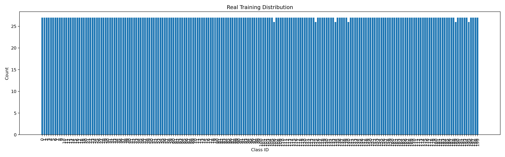
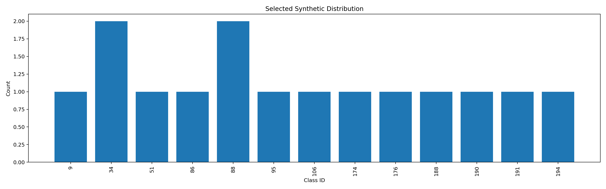
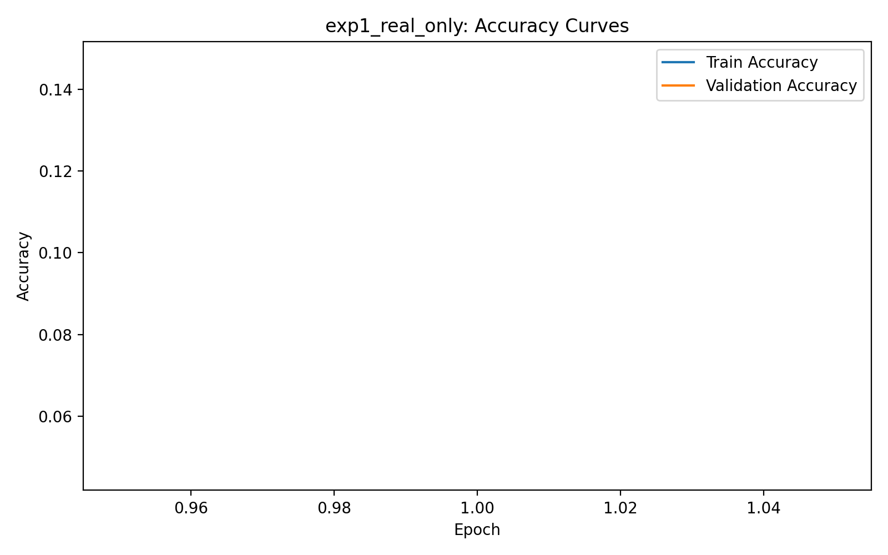
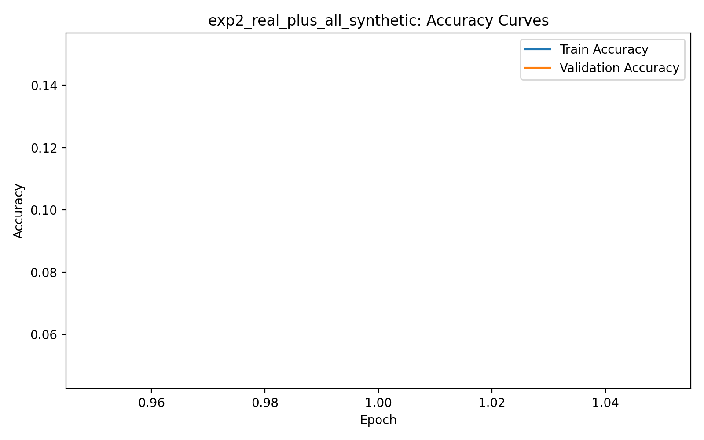
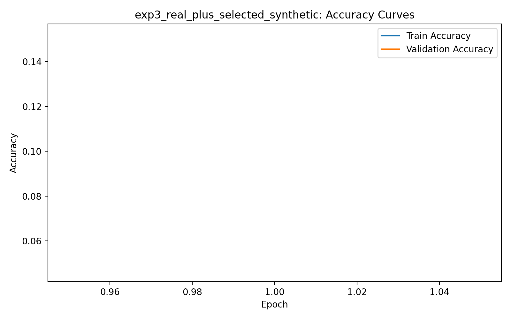
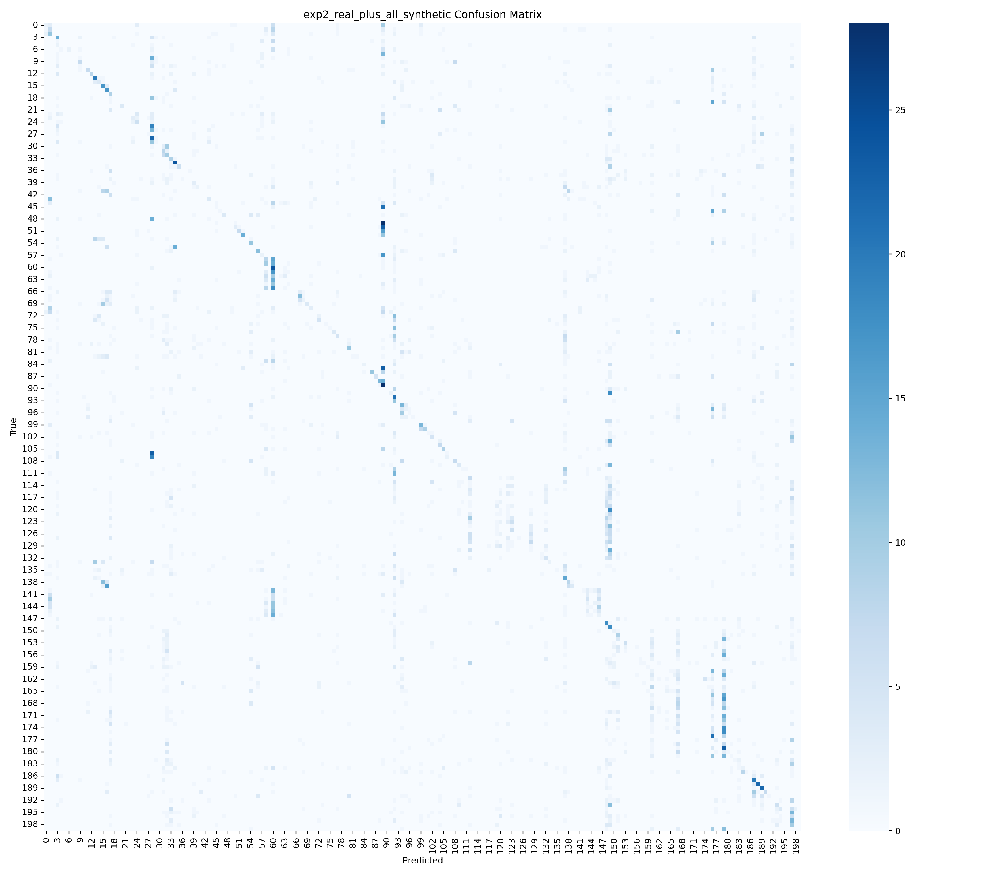

# Improving Automated Generative Data Augmentation with CLIP-DINO Guided Attribute-Aware Sample Selection for Fine-Grained Bird Classification on CUB-200-2011

This project implements a research-style Python pipeline for studying whether AGA-inspired synthetic data can help fine-grained bird classification on CUB-200-2011 when synthetic candidates are filtered before final training. The core idea is not to assume every generated image is useful. Instead, we score synthetic candidates for class consistency, CLIP semantic alignment, DINO-based diversity, class balance, and optional attribute-aware coverage before adding them to the final training set.

The codebase is structured for both a university Generative AI project and a paper draft workflow. It saves reproducible manifests, checkpoints, plots, tables, confusion matrices, and sample grids to disk so the full experimental trail is inspectable.

## Base Paper and Dataset

- Base paper: AGA / Automated Generative Data Augmentation
  https://openaccess.thecvf.com/content/WACV2025/html/Rahat_Data_Augmentation_for_Image_Classification_using_Generative_AI_WACV_2025_paper.html
- Dataset: CUB-200-2011
  https://www.vision.caltech.edu/datasets/cub_200_2011/

## What This Project Implements

- Experiment 1: real-only baseline
- Experiment 2: real + all synthetic candidates
- Experiment 3: real + selected synthetic candidates
- Ablations:
  - confidence only
  - confidence + CLIP
  - confidence + CLIP + DINO
  - confidence + CLIP + DINO + class-balance
  - optional confidence + CLIP + DINO + class-balance + attribute-aware coverage

## Important Honesty Note

This repository implements an AGA-inspired practical generation pipeline, not an exact reproduction of every component in the WACV 2025 paper unless you explicitly replace the generation stage with the exact original method and settings. The provided generator preserves bird foregrounds using CUB bounding boxes plus GrabCut-style foreground estimation and creates context variation through background replacement and appearance perturbation. The downstream scoring, pruning, selection, training, evaluation, and reporting pipeline is fully operational with this practical approximation.

If you want to plug in an external diffusion model, editing model, or API-based generator, use `generate_aga_style_samples.py` as the manifest-producing entry point and preserve the same output schema.

You can also hand off an externally generated manifest directly:

```bash
python src/generate_aga_style_samples.py --external-manifest path/to/synthetic_manifest.csv
```

## Project Structure

```text
project/
  data/
  outputs/
    plots/
    confusion_matrices/
    samples/
    tables/
    logs/
    checkpoints/
  models/
  src/
    prepare_cub.py
    train_baseline.py
    generate_aga_style_samples.py
    score_with_classifier.py
    score_with_clip.py
    prune_with_dino.py
    build_selected_dataset.py
    train_with_augmented_data.py
    evaluate.py
    ablation.py
    plot_results.py
    utils.py
  paper_notes/
    report_assets_checklist.md
    figure_captions.md
    tables_needed.md
  requirements.txt
  README.md
```

## Environment Setup

```bash
cd project
python -m venv .venv
.venv\Scripts\activate
pip install -r requirements.txt
```

If you want CLIP and DINO scoring on GPU, install a CUDA-enabled PyTorch build first.

## Dataset Download and Placement

1. Download the official `CUB_200_2011.tgz` from the Caltech dataset page.
2. Extract it so that the raw files live under:

```text
project/data/CUB_200_2011/
  images/
  images.txt
  image_class_labels.txt
  train_test_split.txt
  classes.txt
  bounding_boxes.txt
  attributes/
```

3. Run dataset preparation:

```bash
python src/prepare_cub.py --raw-dir data/CUB_200_2011 --output-dir data/prepared --val-ratio 0.1 --seed 42
```

This creates `train.csv`, `val.csv`, `test.csv`, `all_metadata.csv`, `class_names.json`, `dataset_summary.json`, and `attributes_image_level.csv` if the CUB attributes files are present.

## Baseline Training Command

```bash
python src/train_baseline.py --prepared-dir data/prepared --image-root data/CUB_200_2011/images --model-name convnext_tiny --epochs 30 --batch-size 32 --lr 3e-4 --weight-decay 1e-4 --use-amp --experiment-name exp1_real_only
```

For faster debugging:

```bash
python src/train_baseline.py --model-name resnet18 --epochs 5 --experiment-name debug_resnet18
```

## Synthetic Generation Command

```bash
python src/generate_aga_style_samples.py --prepared-dir data/prepared --image-root data/CUB_200_2011/images --output-dir outputs/samples/synthetic_candidates --samples-per-image 2 --max-real-images-per-class 30 --seed 42
```

Optional note if you later swap in an external generator:

```bash
python src/generate_aga_style_samples.py --external-generator-note "manual diffusion refinement applied outside repo"
```

## Classifier Scoring Command

Use the best real-only checkpoint to verify intended class and confidence:

```bash
python src/score_with_classifier.py --checkpoint outputs/checkpoints/exp1_real_only.pt --synthetic-manifest outputs/samples/synthetic_candidates/synthetic_manifest.csv --synthetic-root outputs/samples/synthetic_candidates --output-csv outputs/tables/synthetic_classifier_scores.csv
```

## CLIP Scoring Command

```bash
python src/score_with_clip.py --manifest outputs/samples/synthetic_candidates/synthetic_manifest.csv --class-names data/prepared/class_names.json --model-name ViT-B-32 --pretrained laion2b_s34b_b79k --output-csv outputs/tables/synthetic_clip_scores.csv
```

## DINO Pruning Command

```bash
python src/prune_with_dino.py --manifest outputs/samples/synthetic_candidates/synthetic_manifest.csv --similarity-threshold 0.96 --output-csv outputs/tables/synthetic_dino_pruned.csv --embeddings-csv outputs/tables/synthetic_dino_embeddings.csv
```

## Selected Dataset Building Command

```bash
python src/build_selected_dataset.py --prepared-dir data/prepared --classifier-scores outputs/tables/synthetic_classifier_scores.csv --clip-scores outputs/tables/synthetic_clip_scores.csv --dino-pruned outputs/tables/synthetic_dino_pruned.csv --confidence-threshold 0.70 --clip-threshold 0.20 --max-synth-to-real-ratio 0.75 --output-csv outputs/tables/selected_synthetic_manifest.csv
```

Enable attribute-aware coverage if `attributes_image_level.csv` exists:

```bash
python src/build_selected_dataset.py --use-attribute-coverage
```

## Augmented Training Commands

Experiment 2, real + all synthetic:

```bash
python src/train_with_augmented_data.py --prepared-dir data/prepared --image-root data/CUB_200_2011/images --synthetic-manifest outputs/samples/synthetic_candidates/synthetic_manifest.csv --synthetic-root outputs/samples/synthetic_candidates --model-name convnext_tiny --use-amp --warmup-on-real --experiment-name exp2_real_plus_all_synthetic
```

Experiment 3, real + selected synthetic:

```bash
python src/train_with_augmented_data.py --prepared-dir data/prepared --image-root data/CUB_200_2011/images --synthetic-manifest outputs/tables/selected_synthetic_manifest.csv --synthetic-root outputs/samples/synthetic_candidates --model-name convnext_tiny --use-amp --warmup-on-real --curriculum --curriculum-ratio 0.5 --experiment-name exp3_real_plus_selected_synthetic
```

## Evaluation Command

```bash
python src/evaluate.py --checkpoint outputs/checkpoints/exp3_real_plus_selected_synthetic.pt --csv-path data/prepared/test.csv --image-root data/CUB_200_2011/images --class-names data/prepared/class_names.json --experiment-name exp3_test_eval
```

## Ablation Command

```bash
python src/ablation.py --python python --project-src src --prepared-dir data/prepared --image-root data/CUB_200_2011/images --model-name convnext_tiny
```

For publication-grade reporting, run the ablations across multiple seeds and with full training rather than debug settings:

```bash
python src/ablation.py --python python --project-src src --prepared-dir data/prepared --image-root data/CUB_200_2011/images --model-name convnext_tiny --epochs 30 --patience 7 --batch-size 32 --image-size 224 --seeds 42 43 44
```

## Publication Benchmark Command

```bash
python src/run_publication_benchmark.py --python python --project-src src --prepared-dir data/prepared --image-root data/CUB_200_2011/images --model-name convnext_tiny --epochs 30 --patience 7 --batch-size 32 --image-size 224 --use-amp --seeds 42 43 44 --selected-warmup-on-real --selected-curriculum
```

This writes multi-seed benchmark outputs to:

- `outputs/tables/publication_benchmark_runs.csv`
- `outputs/tables/publication_benchmark_summary.csv`
- `outputs/tables/publication_benchmark_config.json`

## Kaggle Optimized Pipeline

For a restart-safe Kaggle workflow with resumable checkpoints, stronger regularization, test-time augmentation, and a proof bundle for reporting:

```bash
python src/run_kaggle_best_pipeline.py --model-name convnext_tiny --epochs 35 --patience 8 --batch-size 16 --grad-accum-steps 2 --num-workers 2 --image-size 224 --lr 2.5e-4 --weight-decay 5e-5 --seed 42
```

See `paper/KAGGLE_RUNBOOK.md` for the recommended setup, fallback settings, and output files to archive.

## Publication Readiness Audit

After running the multi-seed benchmark and ablations, audit the saved outputs before writing strong claims:

```bash
python src/publication_readiness.py
```

This writes:

- `outputs/tables/publication_readiness.json`
- `paper/PUBLICATION_READINESS_REPORT.md`

The audit checks whether the repo has enough evidence for publication-style claims, including:

- presence of the multi-seed benchmark files
- presence of the ablation files
- whether the selected method beats both controls in mean accuracy and mean macro-F1
- whether CLIP/DINO/attribute claims are supported by the ablation table
- whether a direct base-paper comparison has been documented in `outputs/tables/base_paper_comparison.csv`

## Plotting Command

```bash
python src/plot_results.py --metrics-jsons outputs/tables/exp1_real_only_metrics.json outputs/tables/exp2_real_plus_all_synthetic_metrics.json outputs/tables/exp3_real_plus_selected_synthetic_metrics.json --ablation-summary outputs/tables/ablation_summary.csv
```

## Output Folder Explanation

- `outputs/checkpoints`: best model checkpoints
- `outputs/logs`: script logs
- `outputs/plots`: training curves, distribution charts, experiment charts, ablation charts
- `outputs/confusion_matrices`: confusion matrix images
- `outputs/tables`: histories, metrics, reports, selected manifests, experiment summaries, ablation tables
- `outputs/samples`: synthetic candidate images and accepted/rejected sample grids
- `outputs/tables/*_phase_metrics.csv`: warm-up and curriculum phase metrics when staged training is enabled

## Suggested End-to-End Run Order

1. `python src/prepare_cub.py`
2. `python src/train_baseline.py --experiment-name exp1_real_only`
3. `python src/generate_aga_style_samples.py`
4. `python src/score_with_classifier.py --checkpoint outputs/checkpoints/exp1_real_only.pt`
5. `python src/score_with_clip.py`
6. `python src/prune_with_dino.py`
7. `python src/build_selected_dataset.py`
8. `python src/train_with_augmented_data.py --synthetic-manifest outputs/samples/synthetic_candidates/synthetic_manifest.csv --experiment-name exp2_real_plus_all_synthetic`
9. `python src/train_with_augmented_data.py --synthetic-manifest outputs/tables/selected_synthetic_manifest.csv --warmup-on-real --curriculum --experiment-name exp3_real_plus_selected_synthetic`
10. `python src/ablation.py`
11. `python src/plot_results.py --metrics-jsons ...`

## Paper Evidence Gallery

This section collects the strongest saved figures and screenshots for the manuscript and project report. Each figure below already exists in `outputs/`.

### Step 1. Synthetic candidate generation


### Step 2. Real training distribution



### Step 3. Selected synthetic distribution



### Step 4. Main experiment curves

Real-only baseline:



Real plus all synthetic:



Real plus selected synthetic:



### Step 5. Main experiment comparison


Saved single-run headline numbers from `outputs/tables/experiment_comparison.csv`:

- `exp1_real_only`: accuracy `0.1388`
- `exp2_real_plus_all_synthetic`: accuracy `0.1367`
- `exp3_real_plus_selected_synthetic`: accuracy `0.1505`

### Step 6. Accepted vs rejected qualitative evidence


### Step 7. Ablation evidence


Saved single-run ablation summary from `outputs/tables/ablation_summary.csv`:

- `ablation_confidence_only`: accuracy `0.1555`
- `ablation_confidence_clip`: accuracy `0.1505`
- `ablation_confidence_clip_dino`: accuracy `0.1505`
- `ablation_confidence_clip_dino_balance`: accuracy `0.1505`
- `ablation_full_attribute`: accuracy `0.1505`

### Step 8. Confusion matrices





### Step 9. Selection statistics

From `outputs/tables/accepted_rejected_sample_statistics.csv`:

- candidates generated: `400`
- kept after selection: `15`
- rejected: `385`
- selection rate: `3.75%`

### Step 10. Paper preparation order

1. `paper/PUBLISHABILITY_ASSESSMENT.md`
2. `paper/PUBLICATION_READINESS_REPORT.md`
3. `paper/PUBLISHABLE_ROUTE.md`
4. `paper/NOVELTY_AND_CLAIMS.md`
5. `paper/IEEE_PAPER_OUTLINE.md`
6. `paper/IEEE_SUBMISSION_CHECKLIST.md`

### Step 11. Submission files

Use these files for the final paper package:

- `paper/ieee_conference_paper.tex`
- `paper/ABSTRACT_AND_CLAIMS_CURRENT_EVIDENCE.md`
- `paper/GITHUB_PROOF_PACKAGE.md`
- `docs/PROOF_GALLERY.md`

## Practical Limitations

- The generation stage is a foreground-preserving practical approximation to AGA, not a guaranteed exact reproduction.
- CLIP and DINO scoring require model downloads the first time they run.
- Attribute-aware coverage uses CUB attribute metadata linked to parent real images; synthetic attribute labels are therefore proxy assignments, not direct manual annotations.
- Warm-up and curriculum scheduling are implemented as staged training runs with saved per-phase metrics rather than as one monolithic trainer.
- No result numbers are baked into the repository. You must run the experiments and report the saved metrics honestly.

## Report Figure and Screenshot Collection

Use the files under `paper_notes/` as your checklist. In practice, collect:

- dataset preparation summary outputs from `data/prepared/`
- training curves from `outputs/plots/`
- confusion matrices from `outputs/confusion_matrices/`
- accepted/rejected synthetic grids from `outputs/samples/`
- experiment and ablation tables from `outputs/tables/`
- logs from `outputs/logs/` to document run settings

When writing the report, clearly separate:

- exact components reproduced from public resources
- practical approximations
- your proposed CLIP-DINO attribute-aware selection contribution

If you are preparing an IEEE-style manuscript, start from:

- `paper/IEEE_PAPER_OUTLINE.md`
- `paper/IEEE_SUBMISSION_CHECKLIST.md`
- `paper/RESULTS_FILL_TEMPLATE.md`
- `paper/PUBLICATION_REQUIREMENTS.md`
- `paper/PUBLISHABLE_ROUTE.md`
- `paper/NOVELTY_AND_CLAIMS.md`

## Suggested Claim Framing

You can safely frame the method as:

“An AGA-inspired generative augmentation pipeline with a CLIP-DINO guided attribute-aware sample-selection module for fine-grained bird classification on CUB-200-2011.”

That wording is honest about the generation stage while still highlighting the paper contribution you are adding.

For the safest manuscript wording with the current evidence, prefer:

"An AGA-inspired generative augmentation pipeline with a selective sample-admission module for fine-grained bird classification on CUB-200-2011."
