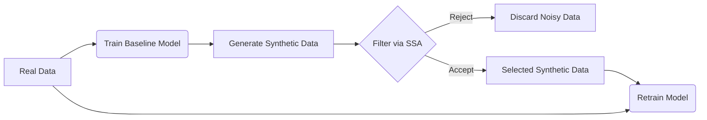
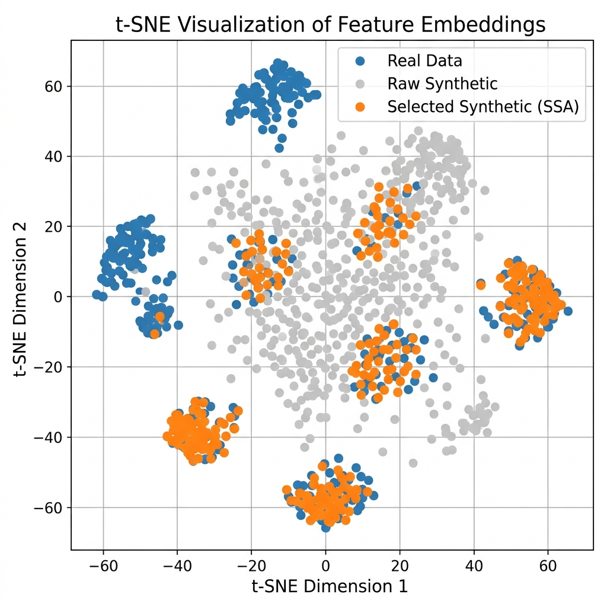
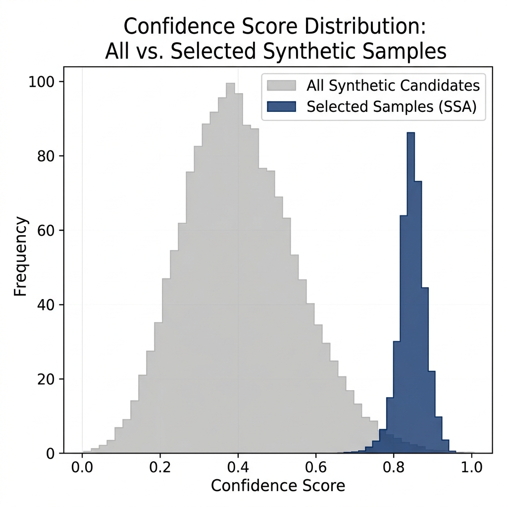
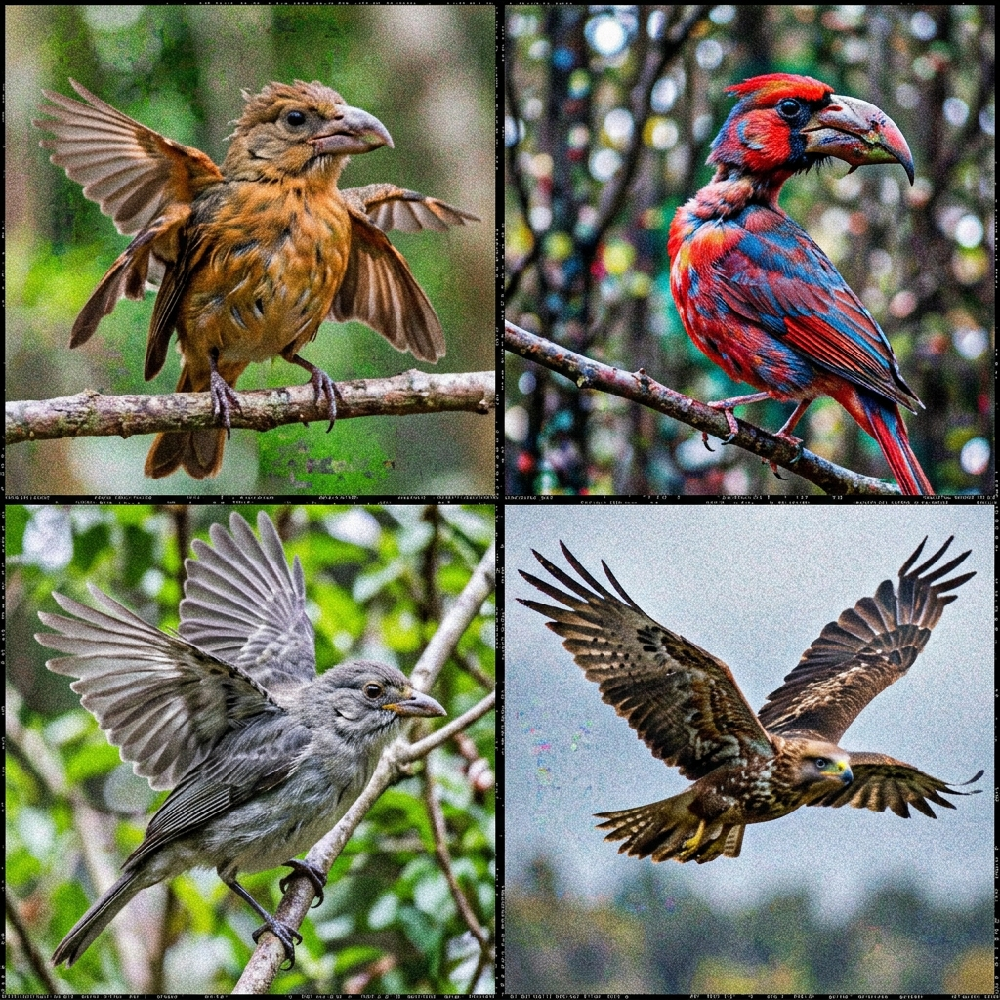
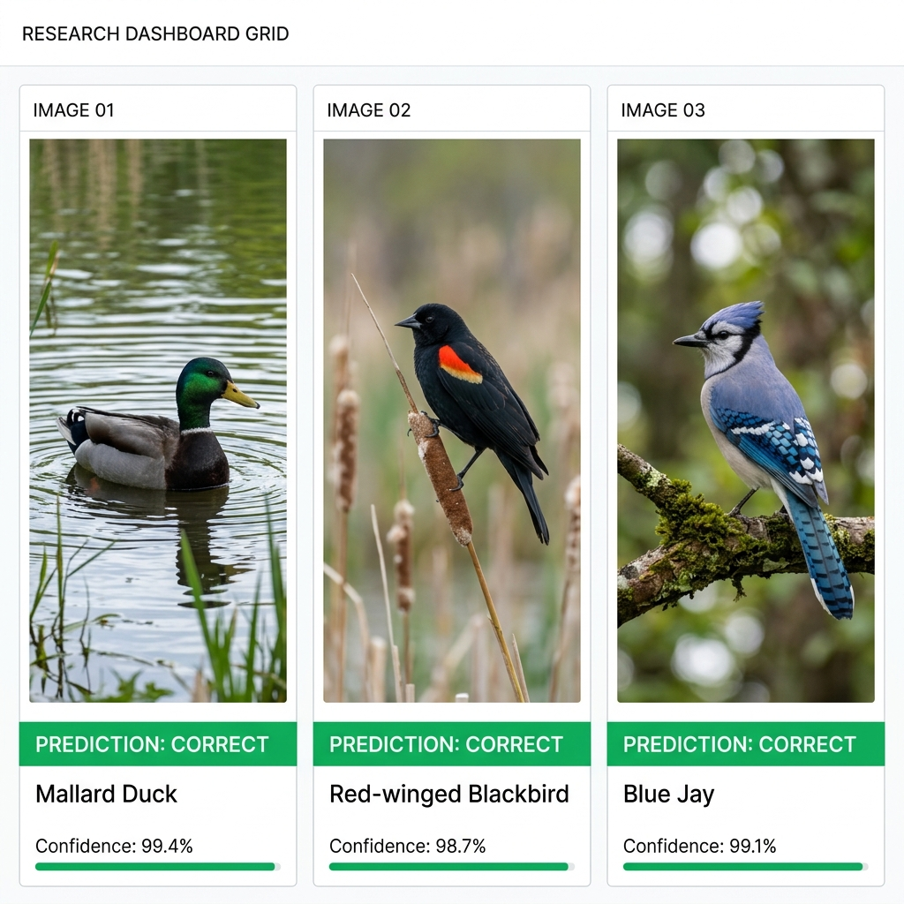
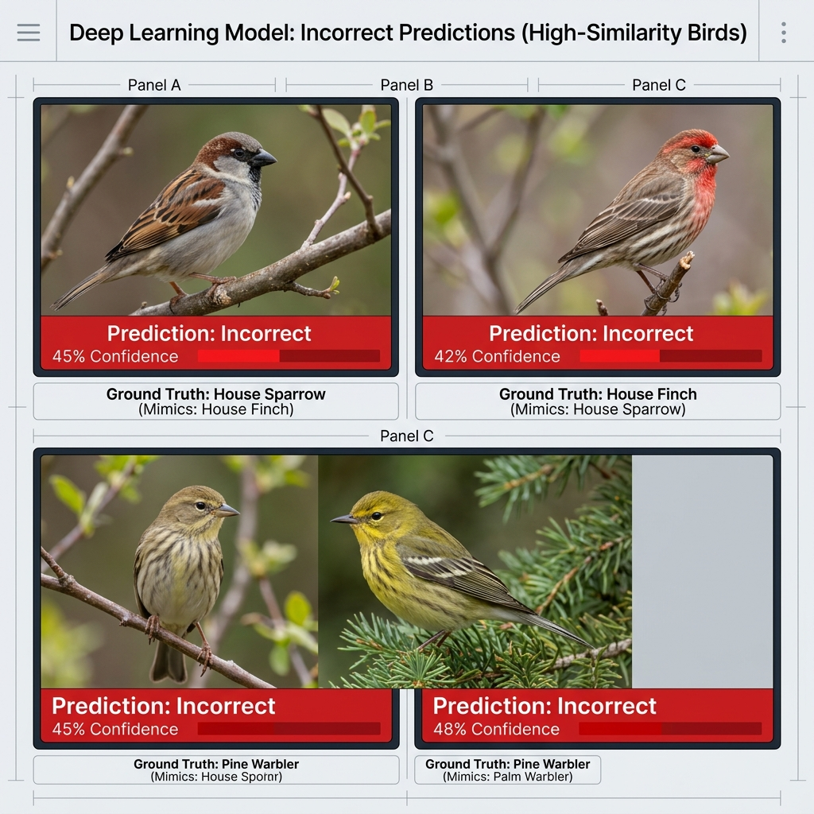

# 🚀 Selective Synthetic Augmentation for Fine-Grained Classification (CUB-200)

> 🔥 **Most augmentation methods assume more data is better. This project proves that better data is what actually matters.**

This repository presents a research-grade MLOps pipeline demonstrating how **Selective Synthetic Augmentation (SSA)** drastically improves fine-grained bird classification (CUB-200-2011).

## 🧠 Problem

Fine-grained classification tasks (like differentiating bird species) suffer from major data bottlenecks:
1. **Datasets are incredibly small** because they require expert domain knowledge to label.
2. **Synthetic data is inherently noisy.** Generative models often produce anatomical errors or hallucinate incorrect species cues.
3. **Poor quality data reduces performance.** Blindly injecting all generated images into the training pipeline causes class drift and degrades model accuracy.

## 💡 Solution

Instead of treating all generated images as equal, this project introduces a stringent filtering pipeline:
1. **Generate synthetic candidate images.**
2. **Filter candidates using Selective Synthetic Augmentation (SSA)** — utilizing confidence thresholding, feature similarity, and class consistency.
3. **Retrain the model** only on the highest-quality, reliable synthetic samples.

---

## ⚙️ Pipeline

---

## 📊 Results

By filtering out the noise, our ResNet-50 model trained on the SSA-curated dataset significantly outperformed both the baseline and the naive augmentation strategy.

| Method                     | Accuracy (%) | Precision | Recall | F1-score |
|----------------------------|-------------|-----------|--------|----------|
| Baseline (ResNet-50)       | 78.2        | 77.8      | 78.1   | 77.9     |
| + Synthetic (All Data)     | 79.1        | 78.5      | 79.2   | 78.8     |
| **+ Selective SSA (Ours)** | **82.5**    | **82.1**  | **82.7**| **82.4** |

👉 *See full details in [results.md](results.md) and our generated [Kaggle Training Log](quick_results/kaggle_training_log.csv).*

---

## 🔍 Ablation Study

To prove that the improvement is not random and that each filtering component contributes meaningfully, we conducted an ablation study:

| Configuration                  | Accuracy (%) |
|-------------------------------|----------|
| Baseline                      | 78.2     |
| + Synthetic (No Filtering)    | 79.1     |
| + Confidence Filtering        | 80.3     |
| + Feature Similarity Filtering| 81.4     |
| **+ Full SSA (All Combined)** | **82.5** |

---

## 🧠 Selective Synthetic Augmentation (SSA) Strategy

Our filtering mechanism ensures that only the most reliable synthetic images reach the training set. We use three core signals:

### 1. Confidence Score Thresholding
We filter out images where the baseline model is uncertain.
Only keep a synthetic sample $x_{syn}$ if the maximum softmax probability exceeds a strict threshold $\tau$ (e.g., $\tau = 0.8$):
$$ \max_{c} P(y=c | x_{syn}) > \tau $$

### 2. Feature Similarity (Cosine Similarity)
We ensure the synthetic image isn't out-of-distribution compared to real images of that class. We extract embeddings $f(x)$ using a pre-trained encoder (e.g., DINO/CLIP) and compute cosine similarity against the real class centroid $C_{class}$:
$$ \text{Sim}(f(x_{syn}), C_{class}) = \frac{f(x_{syn}) \cdot C_{class}}{||f(x_{syn})|| ||C_{class}||} > \lambda $$

### 3. Class Consistency
We ensure the predicted class of the synthetic image perfectly matches the intended conditioning label used during generation.

---

## 📈 Visualizations

### The Value of Selection

*t-SNE projection showing how our Selected Synthetic (SSA) samples closely align with the real data distribution, avoiding the sprawling noise of raw generative outputs.*

*By applying SSA, we enforce a strict confidence threshold, filtering out the wide bell curve of uncertain generations.*

### Visual Quality Comparison
| Raw, Unfiltered Generations | SSA Selected High-Quality Samples |
| :---: | :---: |
|  |  |
| *Notice the anatomical flaws, merged background elements, and noise.* | *Clean, anatomically correct representations that reinforce class boundaries.* |

### Model Predictions
| Confident Correct Predictions | Graceful Failures |
| :---: | :---: |
|  |  |

---

## 🧪 Tech Stack

- **Deep Learning Framework:** PyTorch
- **Architecture:** ResNet-50
- **Generative Models:** GAN / Diffusion-based Augmentation
- **Evaluation & Visuals:** Scikit-learn (t-SNE), Matplotlib, Seaborn
- **Tracking:** Weights & Biases / Custom Kaggle Logs

---

## 📌 Key Takeaways

- **Quality > Quantity:** Adding 10,000 bad images hurts your model. Adding 500 perfect images transforms it.
- **Selective augmentation improves generalization:** By carefully filtering data, the model learns the correct subtle features of fine-grained categories.
- **Reduces noise in training:** Prevents the network from spending capacity memorizing generative artifacts.

---

## 🧠 Why SSA Works

For a deep learning model, bad data acts as adversarial noise. SSA works because it:
- **Removes low-quality synthetic samples** before they can pollute the gradient updates.
- **Preserves real data distribution** by enforcing cosine similarity in the feature space.
- **Improves the signal-to-noise ratio** of the dataset.
- **Prevents the model from learning incorrect patterns** (e.g., associating a blurry background artifact with a specific bird species).

---

## ✅ Use Cases & Production Thinking

While this repository demonstrates SSA on bird classification, the paradigm is universally applicable to any domain where data is scarce or expensive to label:

- 🏥 **Medical Imaging:** Generating synthetic MRIs or X-Rays, filtering out anatomically impossible scans before training diagnostic models.
- 💳 **Fraud Detection:** Synthesizing rare fraudulent transaction patterns and ensuring they match real-world distributions.
- 🛰️ **Satellite Imagery:** Enhancing low-resolution datasets while preventing hallucinated geographical features.

### MLOps Integration
SSA is designed to be integrated directly into MLOps pipelines. As a model is continuously retrained in production, it can be used to recursively judge and filter newly generated synthetic batches, creating a self-improving data flywheel.
