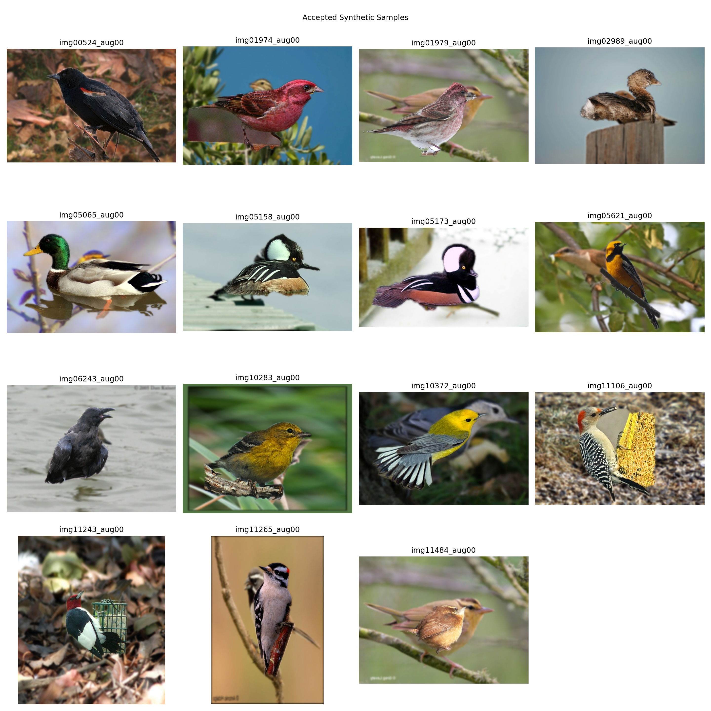
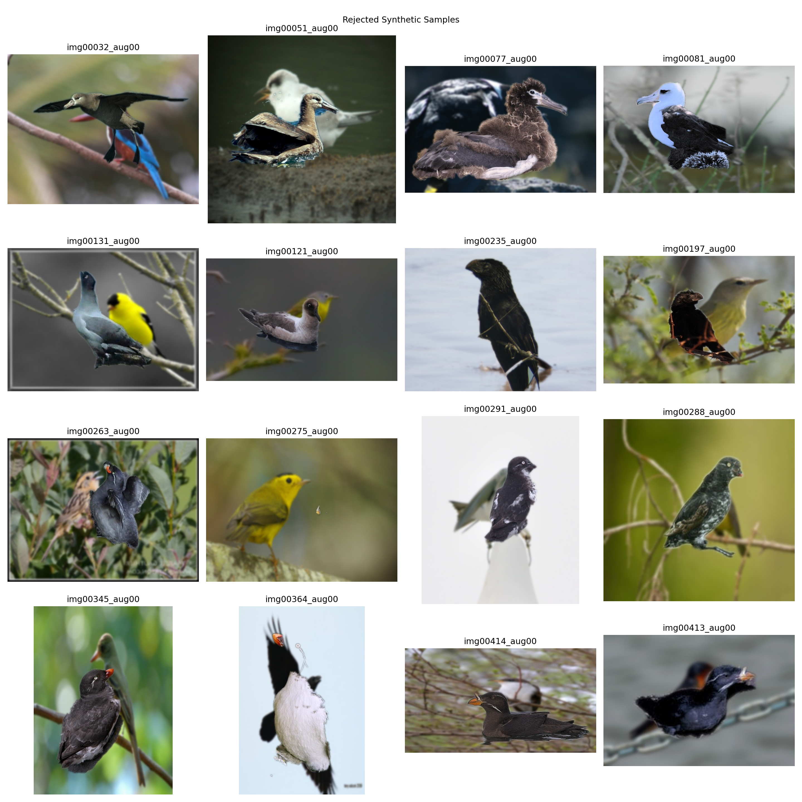
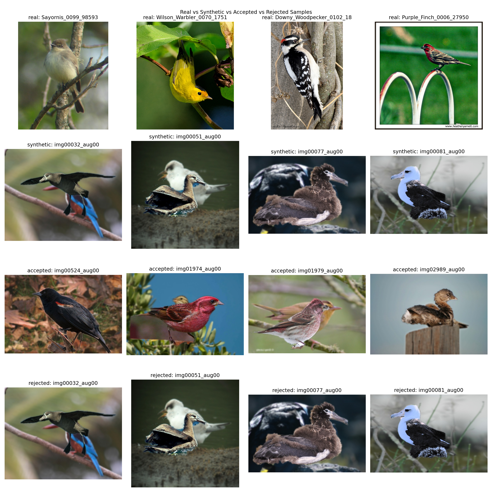
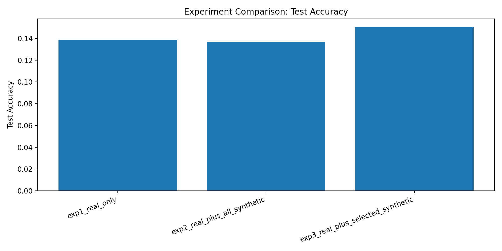
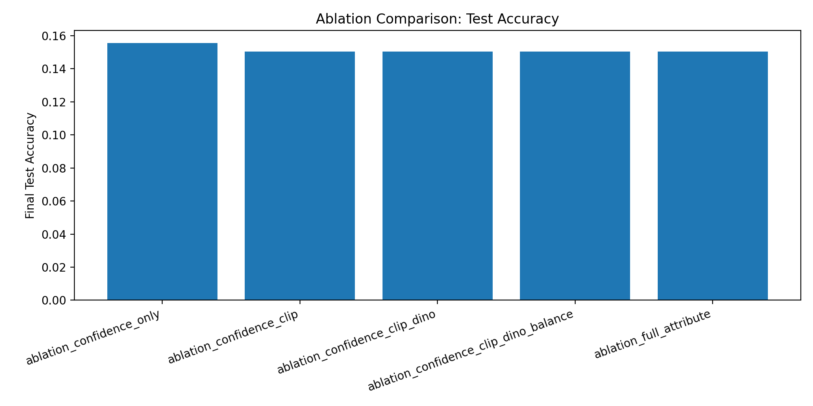
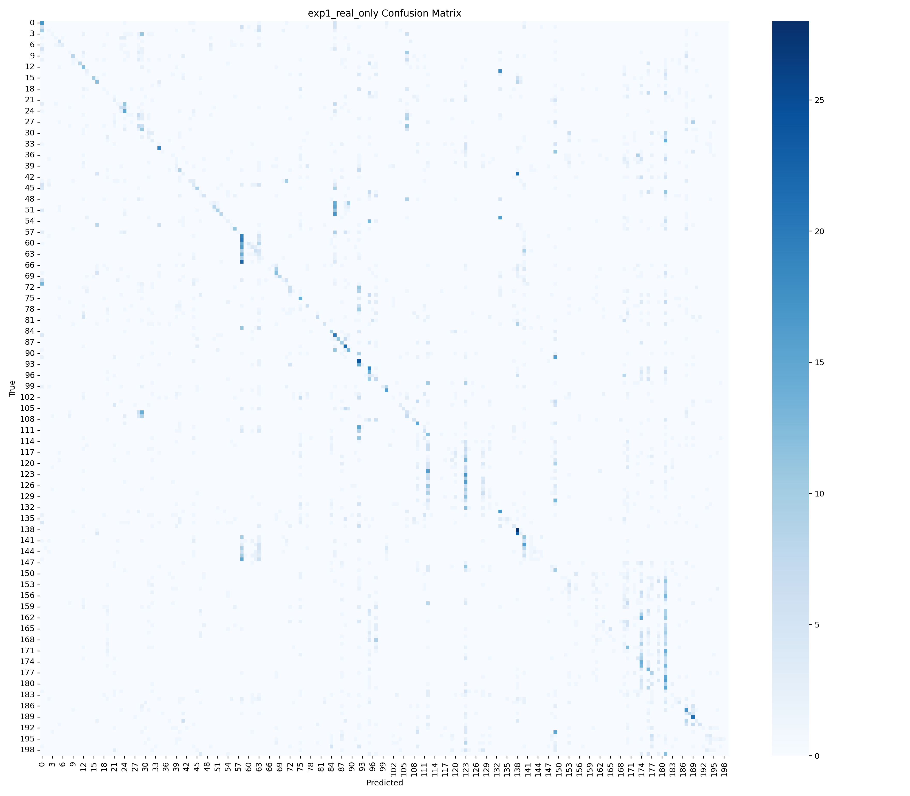
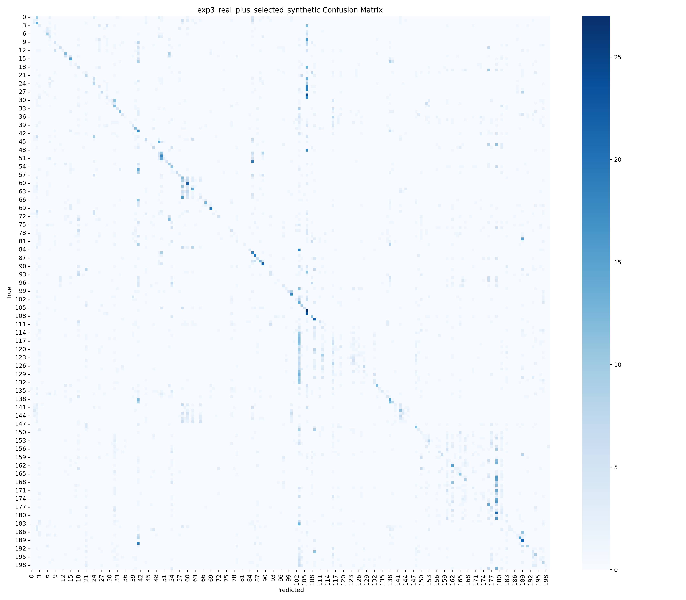

# Proof Gallery

This file is the shortest review path for GitHub visitors and for a project viva. It points to the exact evidence artifacts included in the repository.

## 1. Dataset Evidence

- Dataset summary: [data/prepared/dataset_summary.json](../data/prepared/dataset_summary.json)
- Training split CSV: [data/prepared/train.csv](../data/prepared/train.csv)
- Validation split CSV: [data/prepared/val.csv](../data/prepared/val.csv)
- Test split CSV: [data/prepared/test.csv](../data/prepared/test.csv)
- Class names: [data/prepared/class_names.json](../data/prepared/class_names.json)

Note:
The full CUB-200-2011 image corpus is not committed to GitHub because it is large and should be downloaded from the official dataset source.

## 2. Pipeline Screenshots And Qualitative Proof

Synthetic candidate examples:

Accepted synthetic samples:

Rejected synthetic samples:

Combined qualitative comparison:

## 3. Training And Evaluation Proof

Main experiment comparison:

Ablation comparison:

Baseline confusion matrix:

Selected synthetic confusion matrix:

## 4. Tables Used In The Paper

- Main comparison: [outputs/tables/experiment_comparison.csv](../outputs/tables/experiment_comparison.csv)
- Ablation summary: [outputs/tables/ablation_summary.csv](../outputs/tables/ablation_summary.csv)
- Selection statistics: [outputs/tables/accepted_rejected_sample_statistics.csv](../outputs/tables/accepted_rejected_sample_statistics.csv)
- Diversity statistics: [outputs/tables/sample_diversity_statistics.csv](../outputs/tables/sample_diversity_statistics.csv)
- DINO pruning stats: [outputs/tables/dino_pruning_stats.csv](../outputs/tables/dino_pruning_stats.csv)
- Publication readiness audit: [outputs/tables/publication_readiness.json](../outputs/tables/publication_readiness.json)

## 5. Paper Files

- IEEE draft: [paper/ieee_conference_paper.tex](../paper/ieee_conference_paper.tex)
- Publishability assessment: [paper/PUBLISHABILITY_ASSESSMENT.md](../paper/PUBLISHABILITY_ASSESSMENT.md)
- Abstract and claims: [paper/ABSTRACT_AND_CLAIMS_CURRENT_EVIDENCE.md](../paper/ABSTRACT_AND_CLAIMS_CURRENT_EVIDENCE.md)
- GitHub proof package: [paper/GITHUB_PROOF_PACKAGE.md](../paper/GITHUB_PROOF_PACKAGE.md)

## 6. Reviewer Summary

The strongest evidence currently included in the repository shows:

- selected synthetic augmentation outperformed the real-only baseline in the saved run
- selected synthetic augmentation outperformed naive all-synthetic augmentation in the saved run
- confidence-only filtering was the strongest ablation in the saved outputs
- the paper should be presented as an AGA-inspired empirical study under constrained compute
